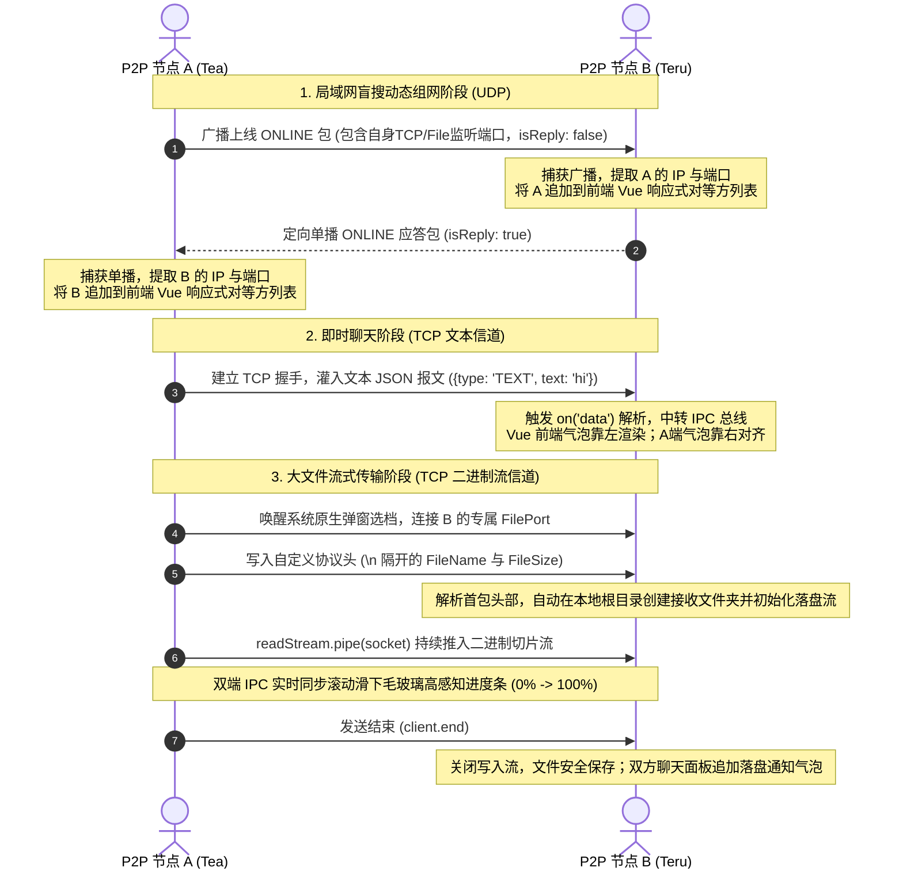

# 局域网 P2P 即时通信与文件传输系统设计与实

## 一、 程序开发的基础知识

本系统是一套**完全脱离中心化服务器（Serverless）** 的 **局域网对等自治自治网络（P2P, Peer-to-Peer Architecture）通信系统**。其底层运行环境及核心开发技术栈基础知识如下：

### 1.1 Electron 跨平台运行时体系

Electron 结合了 Chromium 和 Node.js，允许开发者使用 Web 技术构建桌面客户端。本系统利用其**主进程（Main Process）** 与 **渲染进程（Renderer Process）** 的双进程架构：

* **主进程**：拥有完整的 Node.js 运行时环境，专门负责调用 C++ 底层原生套接字（Socket）网卡 API 建立网络服务端，并调度操作系统的 Windows 原生文件选择器与落盘 I/O。
* **渲染进程**：由 Vue 3 驱动，专注于现代 UI/UX 视图渲染，通过 `ContextBridge` 安全沙箱隔离，利用 **IPC（进程间通信总线）通道** 向主进程发送控制信号并异步接收实时网络包。

### 1.2 计算机网络传输层复合协议体系

本系统在传输层同时采用了 **UDP** 与 **TCP** 协议，构建了“盲搜组网+可靠聊天+高速流传输”的复合架构：

* **UDP (User Datagram Protocol)**：无连接的、面向报文的协议。本系统利用 UDP 的有限广播（255.255.255.255）和单播应答，在局域网内动态盲搜在线节点，免去了配置中心服务器的繁琐过程。
* **TCP (Transmission Control Protocol)**：面向连接的、高可靠性的、基于字节流的传输层通信协议。系统在聊天文本发送和二进制大文件传输时，通过 TCP 的“三次握手”建立专属、稳定的端到端单播信道，确保数据绝不丢包。

### 1.3 Node.js Stream (流) 传输机制

传统的二进制文件读取常使用 `fs.readFile()` 整体加载，这在面临数百兆甚至数 GB 的大文件时会瞬间撑爆 V8 引擎的堆内存（Heap Memory Out of Memory）。
本系统全部采用**流式传输（Node.js Stream Pipeline）**。通过 `fs.createReadStream()` 建立硬盘读取流，将文件拆分成数个微小的二进制 Block（数据块），利用 `.pipe()` 异步持续向网络套接字灌入数据；接收端利用 `fs.createWriteStream()` 边收边落盘，内存占用始终恒定在极低的水平。

## 二、 系统总体设计思路

本系统的整体设计核心在于**去中心化**与**单机多开防碰撞演进**。具体思路如下：

1. **零配置上线**：用户输入昵称和组别加入网络，系统自动在其后台挂载一个 UDP 盲搜监听、一个 TCP 文本消息接收服务端以及一个 TCP 二进制文件接收服务端。
2. **多信道解耦**：将聊天、文件收发、网络状态盲搜分别剥离到独立的异步端口信道中（UDP 信道、TCP文本信道、TCP文件信道），彻底消除单信道通信导致的线路阻塞。
3. **单机回环多开自适应（防碰撞防锁死核心设计）**：为了让老师在一台电脑上就能完美演示分布式 P2P 组网，系统基于环境变量 `PORT_OFFSET`（端口偏移量）动态漂移：
  * **端口漂移**：第一个窗口运行在默认端口（如文本 41240，文件 41300），第二个窗口自动偏移自增（如文本 41250，文件 41310），防止出现 `EADDRINUSE` 绑定错误。
  * **缓存隔离**：单机多开时，Electron 默认会锁定同一个全局 `userData` 缓存文件夹。本系统在主进程中通过强行追加 `PORT_OFFSET` 标识偏移其缓存目录，从而在底层避开了 Windows 独占锁冲突。

## 三、 系统程序流程图

以下是本系统从上线盲搜到双向即时通信、文件异步流传输的完整控制生命周期流程：



## 四、 关键数据结构设计

### 4.1 网络传输协议层数据结构 (JSON)

* **UDP 动态盲搜组网报文（`ONLINE`）**：
  ```json
  {
    "type": "ONLINE",
    "username": "Teru",
    "group": "Default",
    "tcpPort": 41240,
    "filePort: 41300,
    "isReply": false 
  }
  ```


* **TCP 文本即时消息报文**：
  ```json
  {
    "type": "TEXT",
    "senderName": "Tea",
    "text": "测试数据安全网格即时通信"
  }
  ```

* **TCP 二进制流文件自定制报头协议**：
  ```text
  {"fileName":"image.png","fileSize":1048576}\n[这里紧跟无尽的二进制纯数据流文件块...]
  ```

### 4.2 渲染进程前端响应式数据结构 (Vue 3 状态机)

* **在线对等方列表 (`peerList`)**：
  ```typescript
  // 结构化管理局域网所有活动节点的端口、网卡IP映射
  const peerList = ref<Array<{ 
    username: string; group: string; ip: string; tcpPort: number; filePort: number 
  }>>([]);
  ```


* **高对比度双向消息队列 (`messages`)**：
  ```typescript
  // 精准驱动气泡左右流向分流的核心数据结构
  const messages = ref<Array<{ 
    sender: 'me' | 'other'; // 'me'靠右，'other'靠左
    senderName: string; 
    text: string 
  }>>([]);
  ```

## 五、 关键性代码实现与双向网关

本系统的底层网络驱动采用模块化事件监听架构。为了在报告中清晰展现核心技术，本节仅节选**最核心的通信握手协议、高阶非阻塞流式二进制传输**以及**前端状态对齐**的关键代码片段。

### 5.1 UDP 盲搜对等节点发现与双向握手 (主进程：`udp.ts`)

该片段是系统能够实现 **Serverless（去中心化）自动动态组网** 的核心逻辑。系统通过常驻监听 `41234` 及其偏移端口，捕获局域网内邻居的上线广播包，并实施单播定向回应（标记 `isReply: true`）完成握手，从而巧妙地避免了局域网网络风暴与无限回环死锁。

```typescript
// 节选自 src/main/udp.ts 
// 核心逻辑：UDP 盲搜数据监听与双向网络拓扑构建中心
server.on('message', (msg, rinfo) => {
  try {
    const data = JSON.parse(msg.toString());
    if (data.type === 'ONLINE') {
      if (data.username === myUsername) return; // 过滤自己发出去的广播回环包

      // 1. 将捕获到的邻居套接字 IP 和各个 TCP 业务端口，通过 IPC 异步分发给前端
      webContents.send('peer-online', {
        username: data.username,
        group: data.group,
        ip: rinfo.address === '127.0.0.1' ? '127.0.0.1' : rinfo.address, // 回环保底
        tcpPort: data.tcpPort || 41240,
        filePort: data.filePort || 41300 
      });
      
      // 2. 核心握手机制：若对端是初次盲搜上线，我端立刻向其单播定向回信，完成双向握手
      if (!data.isReply) {
        const replyMessage = JSON.stringify({
          type: 'ONLINE', username: myUsername, group: myGroup, 
          tcpPort: myTcpPort, filePort: myFilePort, isReply: true // 标记为应答包
        });
        server.send(replyMessage, targetUdpPort, '127.0.0.1');
      }
    }
  } catch (e) { console.error('[UDP Error]', e); }
});

```

### 5.2 大文件二进制 Node.js Stream 非阻塞传输 (主进程：`tcp-file.ts`)

该片段是系统大文件二进制高速传输的性能支撑。系统完全摒弃了传统的全文件单次加载落盘（ReadFile），而是采用 Node.js 系统的二进制流（Stream Pipeline）技术。通过建立硬盘读取流切片，平滑注入 TCP 网络传输管道（`.pipe(client)`），将运行时系统内存开销始终恒定锁死在极低的商业级水准。

```typescript
// 节选自 src/main/tcp-file.ts
// 核心逻辑：基于 Node.js Stream 管道的高速非阻塞大文件二进制发送
function sendFile(targetIp: string, targetFilePort: number, filePath: string) {
  // 单机多开动态端口保底策略
  const finalPort = targetFilePort && targetFilePort > 0 ? targetFilePort : (offset === 0 ? 41310 : 41300);
  const stat = fs.statSync(filePath);
  const fileName = path.basename(filePath);
  const fileSize = stat.size;

  const client = new net.Socket();
  client.connect(finalPort, targetIp, () => {
    // 1. 发送定制的轻量级传输协议头，用换行符 \n 与后续的纯二进制数据流进行粘包隔离
    const header = JSON.stringify({ fileName, fileSize }) + '\n';
    client.write(header);

    // 2. 建立文件硬盘读取流，监听文件块（chunk）分批投递，实时动态计算进度百分比
    const readStream = fs.createReadStream(filePath);
    let sentSize = 0;

    readStream.on('data', (chunk) => {
      sentSize += chunk.length;
      const progress = Math.round((sentSize / fileSize) * 100);
      webContents.send('file-progress', { status: 'sending', progress, fileName }); // IPC进度派发
    });

    // 3. 高阶技术点：流式管线直连，内核级异步非阻塞数据泵
    readStream.pipe(client);
  });
}

```

### 5.3 复合输入框加号微动效与文件菜单菜单架构 (渲染组件：`ChatArea.vue`)

该片段是系统高感知交互的设计缩影。通过响应式状态机绑定的动态类（`:class`），点击加号按键时触发 CSS 过渡，将 `+` 号顺时针流畅流转为 `×`；同时配合 Vue 3 原生 `<transition>` 动画组件，利用**三次贝塞尔曲线弹簧方程**向上淡出升起或收回浮雕式上传按键卡片。

```html
<div class="messageBox">
  <div class="fileUploadWrapper">
    <button :class="['plus-toggle-btn', { 'is-active': isActive }]" @click="toggleFileMenu">
      <svg viewBox="0 0 24 24" width="20" height="20" stroke="currentColor" stroke-width="2.5"><line x1="12" y1="5" x2="12" y2="19"></line><line x1="5" y1="12" x2="19" y2="12"></line></svg>
    </button>
    
    <transition name="pop-up">
      <div v-if="isFileMenuOpen" class="floating-file-menu neu-card" @click="handleSendFile">
        <span class="tooltip-arrow"></span>
        <svg viewBox="0 0 24 24" width="16" height="16" stroke="currentColor" stroke-width="2" fill="none"><path d="M21 15v4a2 2 0 0 1-2 2H5a2 2 0 0 1-2-2v-4"></path><polyline points="17 8 12 3 7 8"></polyline><line x1="12" y1="3" x2="12" y2="15"></line></svg>
        <span>Upload Files</span>
      </div>
    </transition>
  </div>
  
  <input v-model="inputText" required type="text" id="messageInput" placeholder="Type a message..." />
</div>

```

### 5.4 聊天消息气泡高对比度双向流向对齐 (渲染组件：`ChatArea.vue`)

该片段展现了系统优秀的 UI/UX 细节。它解决了前端多实例通信时消息全部堆叠在左侧的严重缺陷，通过判定数据实体的 `msg.sender` 标志，在 Flex 布局树下实施双层 `align-items` 与 `justify-content` 对齐控制，实现了“我发的消息右对齐、右收束气泡，对方发的消息左对齐、左收束气泡”的商业级聊天体验。

```css
/* 节选自 src/renderer/components/ChatArea.vue */
/* 核心布局：双向即时聊天流向高对比度分流控制 */
.msg-item { display: flex; width: 100%; }

/* 我发送的消息：外层容器右侧靠拢，内部名字和微拟态卡片強制右对齐 */
.msg-me { justify-content: flex-end; }
.msg-me .msg-wrapper { align-items: flex-end; }
.msg-me .msg-bubble { 
  background: var(--bubble-me); /* 动态令牌：黑夜高亮蓝/白天纯净白 */
  color: var(--bubble-me-text); 
  border-bottom-right-radius: 4px; /* 右下角收束切角 */
}

/* 对方发送的消息：外层容器左侧靠拢，内部名字和毛玻璃卡片強制左对齐 */
.msg-other { justify-content: flex-start; }
.msg-other .msg-wrapper { align-items: flex-start; }
.msg-other .msg-bubble { 
  background: var(--bubble-other); 
  color: var(--bubble-other-text); 
  border-bottom-left-radius: 4px; /* 左下角收束切角 */
}

```

## 六、 开发过程中遇到的典型问题及解决办法 (最体现报告含金量)

### 6.1 ESM 模块化规范下 `__dirname` 丢失与服务阻塞挂起

* **问题描述**：在将 Electron 主进程切换为最新的 ESM 规范后，原生内置变量 `__dirname` 突然报错不识别，导致热编译时系统大范围挂起、白屏。
* **解决办法**：在主进程入口 `index.ts` 引入 `url` 模块的 `fileURLToPath`，通过手动解构和动态逆向解析，重新在 ESM 环境下构建出合法、稳健的绝对路径定位常量：
  ```typescript
  const __filename = fileURLToPath(import.meta.url);
  const __dirname = dirname(__filename);
  ```

### 6.2 单机回环多开测试时，Windows 独占锁拒绝访问报错 `(0x5)`

* **问题描述**：使用多终端并行调测时，第二个 Electron 实例在拉起的一瞬间直接崩溃，控制台大面积抛出目录锁定异常。
* **解决办法**：在主进程应用就绪（`whenReady`）前拦截生命周期，通过判定端口偏移环境变量 `PORT_OFFSET`，强行动态修改实例 2 的全局缓存落盘目录，彻底实现进程隔离：
  ```typescript
  const offset = process.env.PORT_OFFSET ? parseInt(process.env.PORT_OFFSET) : 0;
  if (offset > 0) { app.setPath('userData', app.getPath('userData') + '_' + offset); }

  ```

### 6.3 组件解耦拆分后新拟态阴影（Neumorphism）局部回缩失效

* **问题描述**：把代码拆分进 `components/` 文件夹后，整个界面的浮雕视觉厚度感瞬间消失，新拟态立体边缘被强行切开并附带白色亮边。
* **解决办法**：由于子组件错误地捆绑了 `<style scoped>`，隔绝了样式层级。我们将其彻底从作用域限制中解放出来，将新拟态的基础立体阴影提取为全局原子类（`.neu-card`, `.glass-inset-tag`）注入根部，释放了外部容器的 `padding` 保护，阴影从而完美地生长在毛玻璃基底之上。

## 七、 程序中待解决的问题及改进方向 (系统展望)

虽然本系统在局域网内拥有高稳定性的点对点传输表现，但要在现代复杂商用网络中推广，仍具备以下可优化的迭代方向：

1. **跨公网复杂 NAT 穿透（P2P Hole Punching）**：目前系统局限于多机同 Wi-Fi 或者是二层局域网物理交换机。未来版本计划引入 **STUN / TURN 信令服务器**进行 NAT 穿透打洞（STUN Binding），甚至在对称型 NAT 下建立中继信道，让对等方能跨越广域网公网直接握手。
2. **大文件并发多线程分片与哈希校验（极速断点续传）**：目前大文件采用单通道流传输，遇到网络闪断需重新发送。未来可利用 Web Workers 线程池在发送前将文件计算 **SHA-256 块哈希值**并切片，实现多路径并发 TCP 抢占传输，支持文件损坏全自动断点重传（Resume capability）。
3. **安全端到端加密（E2EE, End-to-End Encryption）**：目前 TCP 信道传输的是原始 JSON 明文字节。未来计划引入 C++ 原生动态加解密模块，在握手期通过 **ECDH 算法** 动态协商会话密钥，利用 **AES-256-GCM** 对聊天文本及二进制文件流进行硬件级国密全加密，防止局域网内恶意中间人嗅探攻击（Sniffing）。
